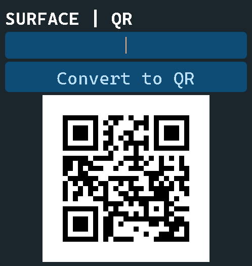

# 🚀 SURFACE QR Generator

<div align="center">

<!-- TODO: Add project logo/icon. Recommend using 'icon.ico' if suitable, e.g., converted to PNG or SVG. -->
<!-- Example:  -->

[](https://github.com/void-ccmdev/surface_qr_generator/stargazers)

[](https://github.com/void-ccmdev/surface_qr_generator/network)

[](https://github.com/void-ccmdev/surface_qr_generator/issues)

[](LICENSE)

**An intuitive, offline QR code generator by SURFACE for desktop environments.**

</div>

## 📖 Overview

The **SURFACE QR Generator** is a user-friendly desktop application designed to generate QR codes without requiring an internet connection that DOES NOT COLLECT DATA. Developed by SURFACE, this tool provides a straightforward way for individuals and businesses to create QR codes from text, URLs, and other data directly on their local machine, ensuring privacy and convenience.

Its primary purpose is to offer a reliable, accessible, and standalone solution for QR code generation, eliminating the dependency on online services. This makes it ideal for environments with restricted internet access or for users who prioritize data security and offline functionality.

## ✨ Features

-   **Offline QR Code Generation**: Create QR codes anytime, anywhere, without an internet connection.
-   **Customizable Input**: Generate QR codes from various data types, including text and URLs.
-   **Image Output**: Save generated QR codes as `.png` image files.
-   **Standalone Desktop Application**: Distributed as an executable for easy deployment and use on Windows, macOS, or Linux (depending on build targets).
-   **Simple Interface**: Designed for ease of use, making QR code creation quick and efficient.

## 🖥️ Screenshots

<!-- TODO: Add actual screenshots of the application's user interface. -->
<!-- Example: -->

<!-- *Main application window for input and generation.* -->

## 🛠️ Tech Stack

**Core Language:**


**Build Tools:**


**Core Libraries (Inferred):**

 (Likely `qrcode` Python library or similar)

## 🚀 Quick Start

This section guides you through setting up and running the SURFACE QR Generator, both as a developer and as an end-user once a release is available.

### Prerequisites
-   **Python 3.x**: Ensure you have a compatible version of Python installed on your system.
    You can download it from [python.org](https://www.python.org/downloads/).

### Installation (For Developers)

1.  **Clone the repository**
    ```bash
    git clone https://github.com/void-ccmdev/surface_qr_generator.git
    cd surface_qr_generator
    ```

2.  **Install dependencies**
    The project uses `pip` for dependency management. Install `PyInstaller` (for building executables) and `qrcode` (for QR code generation).
    ```bash
    pip install pyinstaller qrcode
    ```

### Running the Application (For Developers)

To run the application directly from the Python script:

```bash
python sur_qr_gen.py
```

This will launch the application window, allowing you to generate QR codes.

### Running the Application (For Users - Pre-built Executable)

<!-- TODO: Provide a link to releases where pre-built executables can be downloaded. -->
Once a release is available, you can download the appropriate executable for your operating system from the [Releases page](https://github.com/void-ccmdev/surface_qr_generator/releases).

1.  Download the executable.
2.  Run the executable (e.g., `surface_qr_gen.exe` on Windows).

## 📁 Project Structure

```
surface_qr_generator/
├── build/                 # PyInstaller's temporary build directory
├── dist/                  # Output directory for PyInstaller (contains the final executable)
├── icon.ico               # Application icon file
├── LICENSE                # MIT License file
├── qrcode.png             # Example or default QR code image
├── README.md              # This README file
├── sur_qr_gen.py          # Main Python script containing the application logic
└── surface_qr.spec        # PyInstaller specification file for building the executable
```

## 🔧 Development

### Building the Executable

To create a standalone executable for the application using PyInstaller, execute the following command:

```bash
pyinstaller surface_qr.spec
```

This command will use the `surface_qr.spec` file to build the application. The final executable will be located in the `dist/surface_qr_generator/` directory (the exact path may vary slightly based on OS and PyInstaller version).

## 🤝 Contributing

We welcome contributions to the SURFACE QR Generator! If you have suggestions, bug reports, or want to contribute code, please feel free to open an issue or pull request.

## 📄 License

This project is licensed under the [MIT License](LICENSE) - see the `LICENSE` file for details.

## 🙏 Acknowledgments

-   **Python**: The versatile programming language powering this application.
-   **PyInstaller**: For packaging Python applications into standalone executables.
-   **segno** (or similar library): The library enabling robust QR code generation.

## 📞 Support & Contact

-   🐛 Issues: [GitHub Issues](https://github.com/void-ccmdev/surface_qr_generator/issues)

---

<div align="center">

**⭐ Star this repo if you find it helpful!**

Made with ❤️ by [void-ccmdev](https://github.com/void-ccmdev)

</div>
